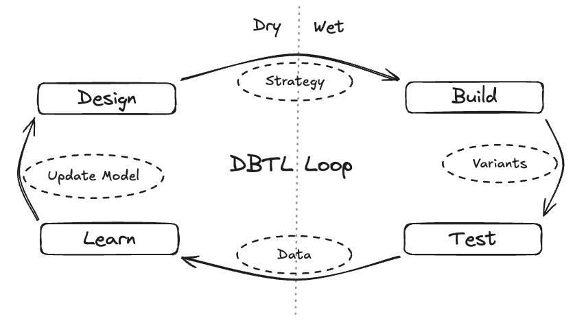

At its core, the purpose of a biological system is to perform its function as efficiently as possible. From an enzyme speeding up chemical reactions in a metabolic pathway to the coordinated firing of neurons in the brain, life is a masterclass in optimization. When an organism deviates from its optimal function, we call it disease. It seems logical, then, that if we could fully understand the system—every gene, every protein, every interaction—we should be able to diagnose problems and design perfect solutions. However, the path from understanding to intervention is defined by a barrier of unimaginable scale.

## Astronomical Complexity

The primary obstacle to this vision is the sheer, incomprehensible complexity of biological systems. The "search space"—the total number of possible configurations for biological molecules—is astronomically large.

Consider a single, moderately-sized protein made up of 100 amino acids. Since there are 20 common amino acids, the number of possible unique sequences is $20^{100}$, which is approximately $10^{130}$. This number is profoundly vast, far exceeding the estimated number of atoms in the known universe ($10^{80}$), and even the number of possible variations in a game of chess ($10^{120}$)[^1]. The search space for nucleic acids is similarly daunting; a tiny segment of DNA just 100 base pairs long has $4^{100}$ (~$10^{60}$) possible sequences.

If we were to attempt to find a specific functional protein or gene by "brute force"—testing every single possibility—the endeavor would be hopeless. Even using the most advanced high-throughput screening technologies, testing every possible 100-amino-acid protein sequence would take longer than the age of the universe by many orders of magnitude. Brute force is, simply, dead on arrival. So, if we cannot search the entirety of biology's search space, what can we do?

## The Promise of Engineering

For the first time in history, biology has the opportunity to be engineering, not purely science[^2]. Science seeks to understand the world as it is by mapping the vast, unknown territory. This is like trying to solve the game of chess by calculating every possible move from the opening. It's a quest for total knowledge, but it's computationally impossible.

Engineering, on the other hand, seeks to build a functional solution to a specific problem. It's like a grandmaster playing to win. They don't analyze every possible move, instead, they use established principles (like opening theory), pattern recognition, and a clear goal (checkmate) to find an effective path through the complexity of the game[^3]. Engineering prunes the search space by focusing on a desired outcome.

But why now? This shift isn't just a philosophical one; it's enabled by a powerful convergence of three technological revolutions[^4]:

1. **Deep Learning Worked:** AI models built on transformer architectures, like AlphaFold2, can now create truly predictive models of complex biological systems. By training on massive datasets, these models can simulate biological outcomes with incredible accuracy, giving us the "smarts" to design effectively.
2. **Data Got Cheap and Plentiful:** Predictive models are only as good as the data they're trained on. The revolution in lab automation and high-throughput sequencing has caused the cost of collecting biological data to plummet, providing the vast amounts of high-quality fuel needed for these AI engines. However, there is still work to be done[^5].
3. **We Can Build What We Design:** A perfect design is useless if you can't build it. Technologies like CRISPR have made the precise editing of genomes routine, while advances in DNA synthesis allow us to write new genetic code from scratch. This gives us the fabrication tools to turn digital designs into physical biology.

In biology, this engineering approach is embodied by the Design-Build-Test-Learn (DBTL) cycle. Instead of searching blindly, the DBTL loop provides a framework for guided exploration. Propose designs, make them, measure them, update beliefs, repeat.

*The DBTL loop is the core engine of modern bioengineering. It begins in the dry lab with a computational Design strategy, moves to the wet lab to Build and Test physical variants, and closes the loop by using the resulting data to Learn and update the model for the next iteration.*

Let's look at a concrete example: improving the enzyme used in Continuous Glucose Monitors (CGMs). A key challenge for CGMs is that the enzyme, glucose oxidase, degrades at body temperature, limiting the sensor's lifespan.

1. **Design:** An AI model, trained on protein structures, proposes 10,000 mutations to the glucose oxidase enzyme that it predicts will increase thermal stability without harming its glucose-detecting function.
2. **Build:** Lab automation synthesizes the DNA for these 10,000 variants and uses a cell-free system to produce each unique enzyme.
3. **Test:** Each of the 10,000 enzymes is tested in a high-throughput assay that measures two key parameters: its activity (how well it detects glucose) and its stability (how long it lasts at body temperature).
4. **Learn:** The performance data is fed back to the AI model. It learns which mutations, or combinations of mutations, led to more stable and active enzymes, refining its understanding for the next round of design.

In practice, the objective is to iterate this DBTL loop as quickly and as informatively as possible to maximize the rate at which real-world performance improves.

## Closing the Loop

The success of applying this engineering approach to biology (and solving disease) depends entirely on our ability to accelerate the DBTL loop (accelerate learning). However, progress isn't just about running bigger batches or "going faster." True learning velocity is a product of five distinct, measurable pillars:

1. **Throughput ($τ$):** The engine of the cycle—how many designs are successfully tested per day. This combines the speed of each loop and the scale of each batch, and it's always limited by the tightest bottleneck.
2. **Targeting ($A$):** The quality of our aim. This measures how much better our design strategy is at proposing high-value or high-information candidates compared to a random search.
3. **Decision-relevant Information ($I_*$):** The quality of our feedback. A measurement is only valuable if it reduces the uncertainty that matters for making a better decision in the _next_ round of design.
4. **Reliability ($R$):** The reality of the lab. This is the fraction of experiments that actually run successfully and pass quality control without needing a re-run, accounting for automation downtime and failed builds.
5. **Fidelity ($Φ$):** The reality check. This measures how well our lab results translate to the real world. An enzyme that scores perfectly in a test tube is useless if it fails inside a CGM sensor.

This can be modeled as:

$$
\textbf{Learning rate}
\;\approx\;
\underbrace{\tau}_{\text{Throughput}}
\times
\underbrace{\mathcal{A}}_{\text{Targeting}}
\times
\underbrace{\mathcal{I}_\ast}_{\text{Info}}
\times
\underbrace{\mathcal{R}}_{\text{Reliability}}
\times
\underbrace{\Phi}_{\text{Fidelity}}
$$

Expanded view:

$$
\begin{aligned}
V
&\approx
\underbrace{u \cdot \min\!\left(C_D,\; C_B\,y_B,\; \dfrac{C_T}{r},\; C_L\right)}_{\tau\ \text{Throughput (designs/day)}}
\times
\underbrace{(\mathrm{Exploit}\times \mathrm{Explore})}_{\mathcal{A}\ \text{Targeting}}
\times
\underbrace{\left(\frac{\mathrm{SNR}}{1+\mathrm{SNR}}\right)}_{g(\mathrm{SNR})\ \text{measurement quality}}
\times
\underbrace{\mathrm{Align}}_{\text{info}\rightarrow\text{decision}}
\times
\underbrace{\mathcal{R}}_{\text{Reliability}}
\times
\underbrace{\Phi}_{\text{Fidelity}}
\end{aligned}
$$

where:

- $V$: Learning rate
- $u$: Utilization
- $C_D$, $C_B$, $C_T$, $C_L$: Max daily capacities of Design/Build/Test/Learn
- $y_B$: Build yield
- $r$: Replicates/design
- $SNR$: Signal-to-noise ratio
- Align $∈ [0,1]$: Fraction of measured info that actually changes the next design choice

Progress isn't about conquering the entire search space. It's about understanding that the true rate of improvement is a product of these five factors. This gives us a blueprint on how we can apply engineering principles to biology to solve disease. By identifying and improving the weakest link, we can navigate the astronomical complexity of life and engineer the solutions that will define the future of health.

## Footnotes

[^1]: This is called the Shannon number. Named after Claude Shannon, it represents the game-tree complexity of a game of chess. It put an end to the dream of brute force.

[^2]: <https://youtu.be/lhdCL-SEwow?si=2Vcm-rVAvJNfKJjI>

[^3]: Simply defining a target outcome is possibly the single most impactful way to reduce the search space. Think of how defining goals in your life impacts the near-infinite range of thoughts and actions you can take at any given moment.

[^4]: <https://www.noahpinion.blog/p/were-entering-a-golden-age-of-engineering>

[^5]: <https://chanzuckerberg.com/newsroom/billion-cells-project-launches-advance-ai-biology/>
